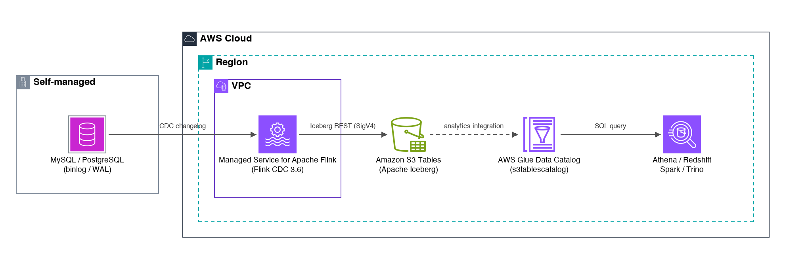

# Build a zero-ETL data lake on Amazon S3 Tables with Flink CDC

Companion code for the blog post *"Build a zero-ETL data lake on Amazon S3
Tables with Flink CDC"*. One streaming application on Amazon Managed Service
for Apache Flink reads a self-managed database's change log directly and keeps
Apache Iceberg tables on Amazon S3 Tables continuously in sync: whole-database
capture, tables created on the fly, new tables picked up live, and schemas
evolving in place.



**Pins:** Apache Flink 2.3 (Managed Service for Apache Flink runtime
`FLINK-2_3`) · Flink CDC `3.6.0-2.2` · Apache Iceberg 1.11.0
(`iceberg-flink-runtime-2.1`) · Amazon S3 Tables (GA). These are the newest
published artifact lines; both are verified running on the Flink 2.3 runtime.

## Sync modes

| Mode (`-c cdcMode=...`) | What it does | When to use |
|---|---|---|
| `dynamic` | Whole-schema sync via Iceberg's `DynamicIcebergSink`: captures every table, creates Iceberg targets on the fly, picks up new tables live, evolves schemas in place | Mirror the whole database with zero per-table wiring (the blog's walkthrough) |
| `single` (default) | Table API job with explicitly declared source and target, one SQL `INSERT` in a statement set | Curated tables: exact declared types, SQL transforms, chosen subset |

Two rules when switching modes: give each mode its **own Iceberg namespace**
(`-c icebergNamespace=...` — their schema/type mappings differ), and never
restore one mode's job from the other's snapshot (use `-c appName=...` for a
fresh application instead).

## Source engines

| Engine (`-c testSource=...`) | Local Docker | Managed Service for Apache Flink |
|---|---|---|
| `mysql` | verified | verified (snapshot + live CDC + live new-table pickup + mid-run schema evolution) |
| `postgres` | verified | verified (snapshot + live CDC) |
| `oracle` | verified | verified (snapshot + live CDC) |

The Iceberg sink and catalog wiring are identical across engines — only the
CDC source configuration changes (`cdc.engine` runtime property, wired
automatically by the CDK test source). Engine notes baked into the job:
PostgreSQL runs `changelog-mode = upsert` so unmodified tables with the
default `REPLICA IDENTITY` work; Oracle bundles the `ojdbc11` driver in the
application JAR (the managed service has no `/opt/flink/lib`) and mirrors the
LogMiner configuration in `sql/oracle-setup.sql`.

### Verified engine versions

The versions this sample was verified against end-to-end (the same versions
the `-c testSource` databases run):

| Engine | Verified version | Prerequisites on the source |
|---|---|---|
| MySQL | 8.4.11 | binlog enabled, `binlog-format=ROW`, `binlog-row-image=FULL` |
| PostgreSQL | 18 (end-to-end, including on Managed Service for Apache Flink; 16 also verified end-to-end) | `wal_level=logical`; the connector's Debezium creates a `FOR ALL TABLES` publication by default (required for live new-table pickup) |
| Oracle | Oracle Database 23ai Free (23.9) | `ARCHIVELOG` mode, supplemental logging, a common (`c##`) mining user with the LogMiner grant set — see `sql/oracle-setup.sql` for the complete, verified setup including the Debezium 1.9 banner-parse workaround for 23ai |

Other versions supported by the Flink CDC 3.6 connectors (per the
[Flink CDC documentation](https://nightlies.apache.org/flink/flink-cdc-docs-release-3.6/))
may work but were not tested here. Version context:

- **MySQL 8.4 is the current LTS line** — the right target for CDC; the 9.x
  innovation releases are not targeted by the connector.
- **PostgreSQL 18 works unchanged.** Verified end-to-end on Managed Service
  for Apache Flink (snapshot plus live UPDATE/INSERT/DELETE propagation)
  against `postgres:18` with zero code or configuration changes — the CDK
  test source deploys PostgreSQL 18 by default. Logical decoding via
  `pgoutput` is stable across PostgreSQL major versions
  (`docker-compose.pgprobe18.yml` holds the standalone local probe).
- **Oracle Database 23ai is the newest release compatible with the bundled
  Debezium (1.9.8)**. Oracle Database 26ai changes the version banner format
  and fails connector startup with "Failed to resolve Oracle database
  version" — pin your image accordingly (this repository pins
  `gvenzl/oracle-free:23.9-slim` for exactly this reason).

### Iceberg table format versions

Amazon S3 Tables supports Iceberg format **v2 and v3**. This sample creates
tables as **v2** by default because v2 is readable today by Amazon Athena,
Amazon Redshift, Apache Spark, Trino, and Flink. Format version is a table
property, independent of the Flink or Iceberg library version — the bundled
`iceberg-flink-runtime-2.1:1.11.0` writes either.

```bash
# Opt in to format v3 (deletion vectors + Variant type):
npx cdk deploy -c cdcMode=dynamic -c testSource=mysql -c formatVersion=3
```

Verify that every query engine you use reads v3 before opting in — the
upgrade is one-way, and it applies to tables created after the change (it
does not migrate existing tables).

## Deploy on AWS

Prerequisites: AWS CDK v2, Node.js 18+, Java 11+ with Maven, an AWS account
in a Region where S3 Tables is available.

```bash
cd app && mvn package && cd ..
cd cdk && npm install

# Review what will be created (no resources touched):
npx cdk synth -c cdcMode=dynamic -c testSource=mysql

# Deploy (creates billable resources: the Flink application, a NAT gateway,
# an S3 Tables bucket, and an EC2 test database):
npx cdk deploy -c cdcMode=dynamic -c testSource=mysql
```

Omit `-c testSource` and pass `-c cdcHostname/-c cdcPort/-c cdcDatabase/...`
to point at your own database instead. Context flags: `cdcMode`
(`single|dynamic`), `testSource` (`mysql|postgres|oracle`), `icebergNamespace`,
`appName`, `tableBucketName`, `formatVersion` (`2|3`, default `2`).

### Verify

Query the synced tables from Amazon Athena (the S3 Tables catalog appears
through the AWS Glue Data Catalog federation):

```sql
SELECT * FROM "s3tablescatalog/zero-etl-lakehouse"."lakehouse"."orders" ORDER BY 1;
```

Mutate the source (connect to the test instance with AWS Systems Manager
Session Manager) and watch changes, new tables, and `ALTER TABLE` schema
changes propagate. When piping SQL into the database container, remember
`docker exec -i` (stdin) — and Oracle needs an explicit `COMMIT`.

## Run locally (optional)

A Docker Compose harness (database + MinIO + Iceberg REST catalog + Flink 2.3)
mirrors the AWS deployment one-for-one, because S3 Tables speaks the open
Iceberg REST protocol: `docker compose -f docker-compose.yml up -d` for the
single-table SQL walkthrough, `docker-compose.dynamic.yml` for whole-schema
mode. See the compose files for details.

## Cleanup

```bash
cd cdk && npx cdk destroy
```

Confirm the S3 Tables bucket is deleted to avoid incurring ongoing charges
for stored data.

## Security

See [CONTRIBUTING](CONTRIBUTING.md#security-issue-notifications) for more
information.

## License

This library is licensed under the MIT-0 License. See the LICENSE file.
